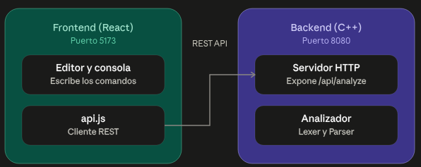
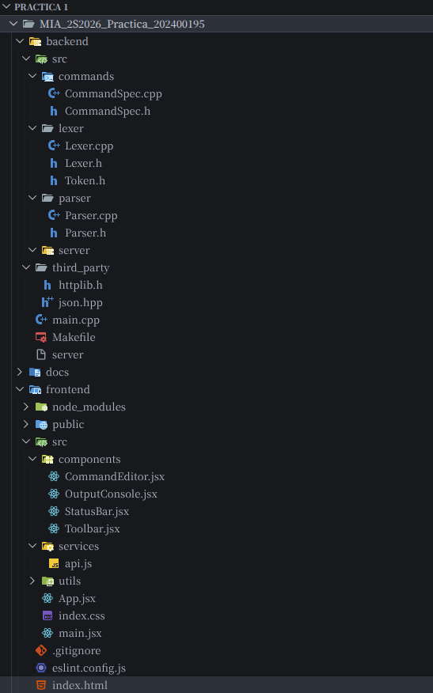
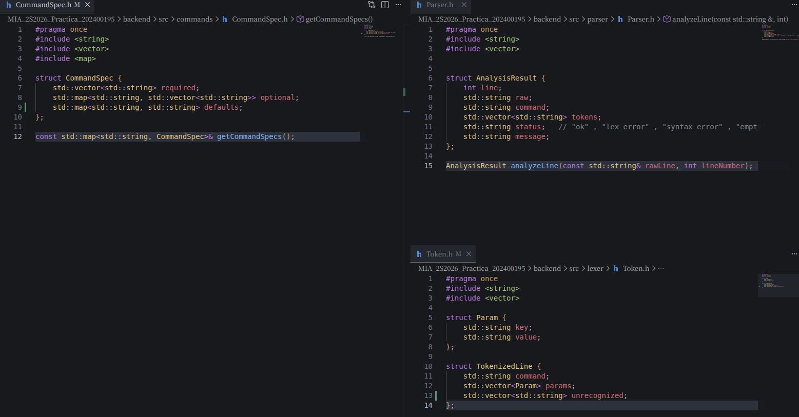
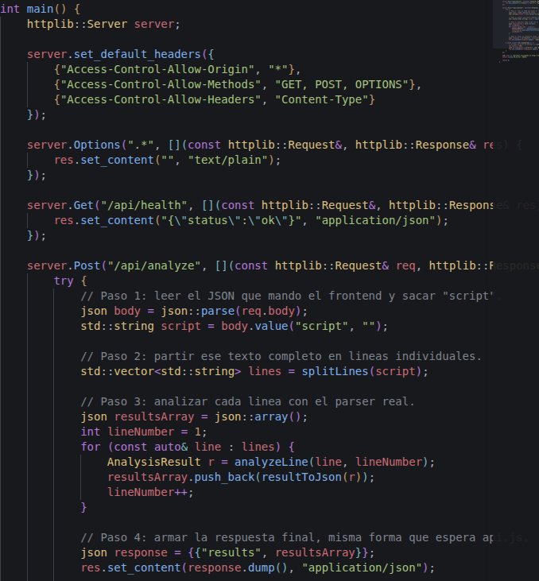
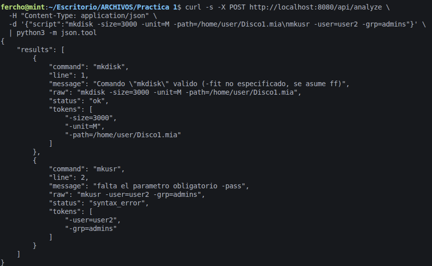
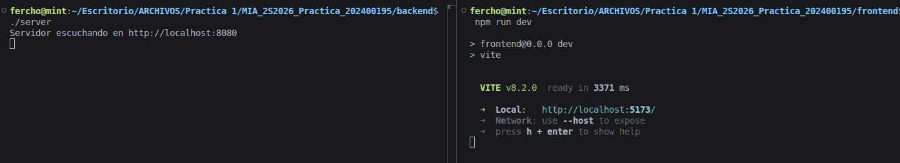

# Manual Tecnico

**Universidad de San Carlos de Guatemala**
Facultad de Ingenieria — Ingenieria en Ciencias y Sistemas
Manejo e Implementacion de Archivos — Practica 1

Analizador Lexico y Sintactico de Comandos EXT2

**Nombre:** Jose Fernando Ramirez Ambrocio
**Carnet:** 202400195

---

## Indice

1. [Introduccion](#1-introduccion)
2. [Arquitectura del sistema](#2-arquitectura-del-sistema)
3. [Estructura de carpetas](#3-estructura-de-carpetas)
4. [Estructuras de datos utilizadas](#4-estructuras-de-datos-utilizadas)
5. [Modulos del backend](#5-modulos-del-backend)
6. [Contrato de la API REST](#6-contrato-de-la-api-rest)
7. [Comandos implementados](#7-comandos-implementados)
8. [Librerias externas utilizadas](#8-librerias-externas-utilizadas)
9. [Compilacion y ejecucion](#9-compilacion-y-ejecucion)
10. [Alcance y limitaciones](#10-alcance-y-limitaciones)

---

## 1. Introduccion

Este documento describe la arquitectura, las estructuras de datos y el funcionamiento interno
del sistema desarrollado para la Practica 1 del curso Manejo e Implementacion de Archivos. El
sistema recibe comandos relacionados con la administracion de discos y sistemas de archivos
EXT2, y valida su estructura lexica y sintactica **sin ejecutar ninguna accion real** sobre
archivos o particiones.

El proyecto se divide en dos componentes independientes que se comunican por medio de una API
REST: un frontend en React, encargado de la interfaz de usuario, y un backend en C++, encargado
de todo el analisis.

---

## 2. Arquitectura del sistema

El sistema sigue una arquitectura cliente-servidor simple, con una separacion clara de
responsabilidades entre las dos partes:

> **Imagen 1 — Diagrama de arquitectura**
> `images/tecnico/01-arquitectura.png`
> Puede ser una captura de este mismo diagrama, o uno propio hecho a mano/en una herramienta
> como draw.io, mostrando frontend, backend y la flecha de comunicacion por REST.


El frontend nunca analiza los comandos por si mismo durante una entrega formal: unicamente envia
el texto escrito por el usuario al backend, y pinta en pantalla la respuesta que recibe. Toda la
logica de validacion vive en el backend. (El frontend incluye, ademas, un analizador local de
respaldo en JavaScript que se activa solo si el backend no responde, para poder probar la
interfaz durante el desarrollo; ese modulo no forma parte de la logica de evaluacion del
sistema.)


### 2.1 Flujo de una peticion

1. El usuario escribe uno o varios comandos en el editor y presiona "Analizar".
2. El frontend junta todo el texto y lo envia con una peticion POST a `/api/analyze`.
3. El backend recibe el texto y lo separa en lineas individuales.
4. Cada linea pasa primero por el Lexer, que la separa en comando y parametros.
5. El resultado del Lexer se compara contra el reglamento de comandos (CommandSpec).
6. El Parser arma un resultado por linea: valida (`ok`), error lexico o error sintactico.
7. El backend junta todos los resultados en un arreglo JSON y responde al frontend.
8. El frontend recorre ese arreglo y pinta una fila por linea en la consola de resultados.

---

## 3. Estructura de carpetas

### 3.1 Backend (C++)

```
backend/
├── main.cpp                   Punto de entrada, define el servidor y las rutas HTTP
├── Makefile                   Receta de compilacion
├── third_party/
│   ├── httplib.h              Libreria externa: servidor HTTP
│   └── json.hpp               Libreria externa: lectura/escritura de JSON
└── src/
    ├── lexer/
    │   ├── Token.h            Estructuras Param y TokenizedLine
    │   ├── Lexer.h            Declaracion de tokenizeLine()
    │   └── Lexer.cpp          Logica que separa una linea en piezas
    ├── commands/
    │   ├── CommandSpec.h      Estructura CommandSpec
    │   └── CommandSpec.cpp    Reglamento de los 8 comandos
    └── parser/
        ├── Parser.h           Estructura AnalysisResult
        └── Parser.cpp         Logica que valida cada linea contra el reglamento
```

### 3.2 Frontend (React)

```
frontend/
├── package.json
├── vite.config.js
├── index.html
└── src/
    ├── main.jsx                Punto de entrada de React
    ├── App.jsx                 Componente principal, conecta todo
    ├── index.css                Estilos de la aplicacion
    ├── services/
    │   └── api.js               Cliente REST: habla con el backend
    ├── utils/
    │   └── mockAnalyzer.js      Analizador local de respaldo (solo para desarrollo)
    └── components/
        ├── Toolbar.jsx          Barra superior: botones y estado de conexion
        ├── CommandEditor.jsx    Editor de comandos con numeracion de linea
        ├── OutputConsole.jsx    Consola de resultados por linea
        └── StatusBar.jsx        Barra inferior con conteos
```

> **Imagen 2 — Arbol de archivos**
> `images/tecnico/02-estructura-carpetas.png`
> Captura del explorador de archivos de VS Code (o `tree` en terminal) mostrando `backend/` y
> `frontend/` ya completos.



---

## 4. Estructuras de datos utilizadas

El backend se apoya en cuatro estructuras principales, cada una definida en su propio archivo de
cabecera (`.h`), de forma que cualquier otro modulo pueda usarlas sin necesitar ver la logica
interna de quien las produce.

### 4.1 `Param` y `TokenizedLine` (`src/lexer/Token.h`)

Representan el resultado de separar una linea en piezas, antes de cualquier validacion.

```cpp
struct Param {
    std::string key;
    std::string value;
};

struct TokenizedLine {
    std::string command;
    std::vector<Param> params;
    std::vector<std::string> unrecognized; // texto que no encajo en ningun -clave=valor
};
```

### 4.2 `CommandSpec` (`src/commands/CommandSpec.h`)

Representa el reglamento de un comando: que parametros son obligatorios, cuales son opcionales
(con la lista de valores permitidos, si aplica), y el valor por defecto que se asume cuando un
parametro opcional con comportamiento por defecto no se escribe.

```cpp
struct CommandSpec {
    std::vector<std::string> required;
    std::map<std::string, std::vector<std::string>> optional;
    std::map<std::string, std::string> defaults;
};
```

### 4.3 `AnalysisResult` (`src/parser/Parser.h`)

Representa el resultado final de analizar una linea. Su forma coincide exactamente con lo que el
frontend espera recibir por cada linea, para poder pintarla en la consola de resultados sin
necesitar transformaciones adicionales.

```cpp
struct AnalysisResult {
    int line;
    std::string raw;
    std::string command;
    std::vector<std::string> tokens;
    std::string status;   // "ok" | "lex_error" | "syntax_error" | "empty"
    std::string message;
};
```

> **Imagen 3 — Estructuras en el editor**
> `images/tecnico/03-estructuras-codigo.png`
> Captura de `Token.h`, `CommandSpec.h` y `Parser.h` abiertos en el editor.



---

## 5. Modulos del backend

### 5.1 Lexer (analisis lexico)

Responsable de separar una linea de texto en piezas reconocibles: el nombre del comando y cada
parametro en formato `-clave=valor` (respetando valores entre comillas cuando contienen
espacios, y permitiendo banderas sin valor como `-r`). No juzga si el comando o los parametros
son validos; solo reconoce su forma. Ademas registra cualquier texto que no haya podido
interpretar como parametro (por ejemplo, una ruta con espacios sin comillas), para que el Parser
lo reporte como error.

### 5.2 CommandSpec (reglamento de comandos)

Contiene, en forma de tabla estatica en memoria, las reglas de los 8 comandos exigidos por la
practica. Es codigo puramente declarativo: no contiene logica de validacion, unicamente los
datos que el Parser va a consultar.

### 5.3 Parser (analisis sintactico)

Es el modulo que aplica las reglas. Recibe una linea cruda, la pasa por el Lexer, busca el
comando correspondiente en el reglamento, y valida:

- Presencia de todos los parametros obligatorios.
- Parametros desconocidos (que no estan ni en `required` ni en `optional`).
- Valores permitidos en parametros con lista fija (`-fit`, `-unit`, `-type`).
- Que `-size` sea un numero positivo.
- Que `-user`, `-pass` y `-grp` no superen los 10 caracteres indicados en el enunciado.
- Texto suelto que el Lexer no pudo interpretar como ningun parametro.

Si encuentra uno o mas problemas, los junta en un solo mensaje separado por punto y coma, y
marca la linea como error lexico (comando no reconocido) o error sintactico (comando valido con
parametros incorrectos). Cuando el comando es valido, ademas revisa la tabla de valores por
defecto: si un parametro opcional con comportamiento por defecto no fue escrito, lo menciona en
el mensaje (por ejemplo, que `-fit` se asume `WF` en `FDISK` cuando no se especifica), sin llegar
a ejecutar ninguna accion real con ese valor.

### 5.4 Servidor (`main.cpp`)

Levanta un servidor HTTP con la libreria cpp-httplib y expone dos rutas:

| Ruta | Metodo | Descripcion |
|---|---|---|
| `/api/health` | GET | Responde un JSON simple para confirmar que el servidor esta activo. |
| `/api/analyze` | POST | Recibe el texto completo de comandos, lo separa en lineas, analiza cada una con el Parser y responde un arreglo de resultados. |

El servidor tambien responde explicitamente a las peticiones `OPTIONS` (usadas por el navegador
como aviso previo antes de un POST entre distintos origenes) y agrega los encabezados de CORS
necesarios para que el frontend, corriendo en un puerto distinto, pueda comunicarse sin ser
bloqueado por el navegador.

> **Imagen 4 — Codigo del servidor**
> `images/tecnico/04-main-cpp.png`
> Captura de `main.cpp`, mostrando las rutas `/api/health` y `/api/analyze`.



---

## 6. Contrato de la API REST

### 6.1 Peticion

```http
POST /api/analyze
Content-Type: application/json

{
  "script": "mkdisk -size=3000 -unit=M -path=/home/user/Disco1.mia\nmkusr -user=user2 -grp=admins"
}
```

### 6.2 Respuesta

```json
{
  "results": [
    {
      "line": 1,
      "raw": "mkdisk -size=3000 -unit=M -path=/home/user/Disco1.mia",
      "command": "mkdisk",
      "tokens": ["-size=3000", "-unit=M", "-path=/home/user/Disco1.mia"],
      "status": "ok",
      "message": "Comando \"mkdisk\" valido (-fit no especificado, se asume ff)"
    },
    {
      "line": 2,
      "raw": "mkusr -user=user2 -grp=admins",
      "command": "mkusr",
      "tokens": ["-user=user2", "-grp=admins"],
      "status": "syntax_error",
      "message": "falta el parametro obligatorio -pass"
    }
  ]
}
```

El campo `status` puede tomar cuatro valores: `ok` (comando valido), `syntax_error` (comando
reconocido pero con parametros invalidos o faltantes), `lex_error` (el nombre del comando no
corresponde a ninguno de los 8 soportados), o `empty` (linea vacia o comentario, iniciado con el
simbolo `#`).

> **Imagen 5 — Prueba de la API**
> `images/tecnico/05-prueba-api.png`
> Captura de una peticion real (con `curl` o Postman) al endpoint `/api/analyze`, mostrando la
> peticion enviada y la respuesta JSON recibida.



---

## 7. Comandos implementados

A continuacion se detallan los 8 comandos soportados, sus parametros y un ejemplo de uso valido.
Ningun comando ejecuta una accion real sobre archivos o particiones: el sistema unicamente valida
la estructura de lo escrito.

### MKDISK

| Parametro | Categoria | Valores permitidos |
|---|---|---|
| `-size` | Obligatorio | Numero positivo mayor que 0 |
| `-path` | Obligatorio | Ruta del archivo a crear |
| `-fit` | Opcional | BF, FF, WF (por defecto FF) |
| `-unit` | Opcional | K, M (por defecto M) |

```
mkdisk -size=3000 -unit=M -path=/home/user/Disco1.mia
```

### RMDISK

| Parametro | Categoria | Valores permitidos |
|---|---|---|
| `-path` | Obligatorio | Ruta del disco a eliminar |

```
rmdisk -path="/home/mis discos/Disco4.mia"
```

### FDISK

| Parametro | Categoria | Valores permitidos |
|---|---|---|
| `-size` | Obligatorio | Numero positivo mayor que 0 |
| `-path` | Obligatorio | Ruta del disco |
| `-name` | Obligatorio | Nombre de la particion |
| `-unit` | Opcional | B, K, M (por defecto K) |
| `-type` | Opcional | P, E, L (por defecto P) |
| `-fit` | Opcional | BF, FF, WF (por defecto WF) |

```
fdisk -size=300 -path=/home/Disco1.mia -name=Particion1 -type=P
```

### MOUNT

| Parametro | Categoria | Valores permitidos |
|---|---|---|
| `-path` | Obligatorio | Ruta del disco que contiene la particion |
| `-name` | Obligatorio | Nombre de la particion a montar |

```
mount -path=/home/Disco2.mia -name=Part2
```

### MKFS

| Parametro | Categoria | Valores permitidos |
|---|---|---|
| `-id` | Obligatorio | Id generado por el comando mount |
| `-type` | Opcional | full (por defecto full) |

```
mkfs -type=full -id=341A
```

### MKUSR

| Parametro | Categoria | Valores permitidos |
|---|---|---|
| `-user` | Obligatorio | Texto, maximo 10 caracteres |
| `-pass` | Obligatorio | Texto, maximo 10 caracteres |
| `-grp` | Obligatorio | Texto, maximo 10 caracteres |

```
mkusr -user=user1 -pass=1234 -grp=usuarios
```

### RMUSR

| Parametro | Categoria | Valores permitidos |
|---|---|---|
| `-user` | Obligatorio | Nombre del usuario a eliminar |

```
rmusr -user=user1
```

### MKFILE

| Parametro | Categoria | Valores permitidos |
|---|---|---|
| `-path` | Obligatorio | Ruta del archivo a crear |
| `-r` | Opcional | Bandera sin valor (crea carpetas intermedias) |
| `-size` | Opcional | Numero, no negativo (por defecto 0) |
| `-cont` | Opcional | Ruta de un archivo local con el contenido |

```
mkfile -size=15 -path=/home/user/docs/a.txt -r
```

---

## 8. Librerias externas utilizadas

| Libreria | Donde se usa | Motivo |
|---|---|---|
| cpp-httplib | Backend (`third_party/httplib.h`) | C++ no incluye un servidor HTTP en su libreria estandar. Esta libreria de un solo encabezado permite levantar un servidor REST simple sin dependencias externas complejas. |
| nlohmann/json | Backend (`third_party/json.hpp`) | Permite leer el JSON que envia el frontend y construir la respuesta JSON de forma segura, sin cortar texto manualmente. |
| React + Vite | Frontend | React se usa para construir la interfaz por componentes; Vite es la herramienta de desarrollo y empaquetado, exigida por el enunciado (React, Angular o Vue). |

---

## 9. Compilacion y ejecucion

### 9.1 Backend

```bash
cd backend
make
./server
```

El servidor queda escuchando en `http://localhost:8080`. El comando `make` recompila
automaticamente si algun archivo `.cpp` cambio desde la ultima compilacion.

### 9.2 Frontend

```bash
cd frontend
npm install
npm run dev
```

La aplicacion queda disponible en `http://localhost:5173`. Con el backend corriendo, el
indicador en la barra superior debe mostrar "Backend conectado".

> **Imagen 6 — Terminal en ejecucion**
> `images/tecnico/06-terminales.png`
> Captura de dos terminales lado a lado: una con `./server` corriendo, otra con `npm run dev`
> corriendo.



---

## 10. Alcance y limitaciones

- El sistema valida unicamente la estructura lexica y sintactica de cada linea; no crea,
  modifica ni elimina archivos o particiones reales, conforme al enunciado de la practica.
- El analisis es independiente por linea: no se mantiene un estado entre comandos (por ejemplo,
  el sistema no recuerda que un disco fue creado en una linea anterior para validar una linea de
  `fdisk` posterior).
- La deteccion de comandos y parametros no distingue mayusculas de minusculas, siguiendo los
  ejemplos del enunciado, que mezclan estilos como `-Size` y `-size`.