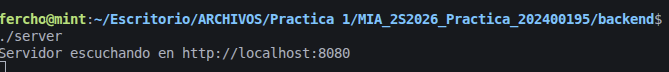
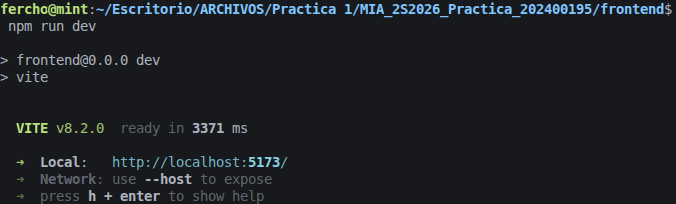
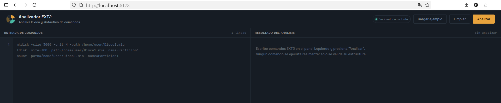
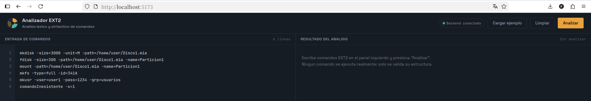
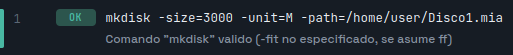
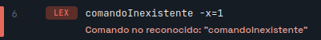

# Manual de Usuario

**Universidad de San Carlos de Guatemala**
Facultad de Ingenieria — Ingenieria en Ciencias y Sistemas
Manejo e Implementacion de Archivos — Practica 1

Analizador Lexico y Sintactico de Comandos EXT2

**Nombre:** Jose Fernando Ramirez Ambrocio
**Carnet:** 202400195

---

## Indice

1. [Que hace este sistema](#1-que-hace-este-sistema)
2. [Requisitos previos](#2-requisitos-previos)
3. [Instalacion y ejecucion](#3-instalacion-y-ejecucion)
4. [Conociendo la interfaz](#4-conociendo-la-interfaz)
5. [Como analizar comandos](#5-como-analizar-comandos)
6. [Como leer los resultados](#6-como-leer-los-resultados)
7. [Solucion de problemas comunes](#7-solucion-de-problemas-comunes)

---

## 1. Que hace este sistema

Esta aplicacion permite escribir comandos relacionados con discos y particiones EXT2 (como
`mkdisk`, `fdisk`, `mount`, `mkusr`, entre otros) y revisar si estan bien escritos: si les falta
algun parametro obligatorio, si usaron un valor no permitido, o si el comando ni siquiera existe.

**Importante:** el sistema no crea discos, particiones ni archivos reales. Unicamente revisa que
el comando este bien escrito, como un corrector ortografico para estos comandos.

---

## 2. Requisitos previos

Antes de usar el sistema, la computadora debe tener instalado:

| Herramienta | Para que se usa |
|---|---|
| Node.js (version 18 o superior) | Correr el frontend (la interfaz) |
| g++ con soporte para C++17 | Compilar el backend (el analizador) |
| make | Compilar el backend con un solo comando |

---

## 3. Instalacion y ejecucion

El sistema tiene dos partes que deben correr **al mismo tiempo**, cada una en su propia terminal.

### 3.1 Iniciar el backend

```bash
cd backend
make
./server
```

Si todo sale bien, la terminal debe quedar mostrando este mensaje, y no debe cerrarse:

```
Servidor escuchando en http://localhost:8080
```

> **Imagen 1 — Backend corriendo**
> `images/usuario/01-backend-corriendo.png`
> Captura de la terminal despues de correr `./server`.



### 3.2 Iniciar el frontend

En una **segunda terminal**, sin cerrar la primera:

```bash
cd frontend
npm install
npm run dev
```

Esto va a mostrar una direccion, normalmente `http://localhost:5173`. Se abre esa direccion en
el navegador.

> **Imagen 2 — Frontend corriendo**
> `images/usuario/02-frontend-corriendo.png`
> Captura de la terminal despues de correr `npm run dev`.



---

## 4. Conociendo la interfaz

Al abrir la aplicacion en el navegador se ven cuatro zonas principales:

> **Imagen 3 — Pantalla completa de la aplicacion**
> `images/usuario/03-pantalla-completa.png`
> Captura de toda la aplicacion abierta, antes de escribir nada.



1. **Barra superior** — el nombre de la aplicacion, un indicador que dice si el backend esta
   conectado, y los botones Cargar ejemplo / Limpiar / Analizar.
2. **Editor de comandos** (lado izquierdo) — aqui se escriben los comandos, uno por linea.
3. **Consola de resultados** (lado derecho) — aqui aparece, despues de analizar, el resultado de
   cada linea.
4. **Barra inferior** — un resumen: cuantas lineas hay, cuantas son validas y cuantas tienen
   error.

---

## 5. Como analizar comandos

1. Escribir uno o varios comandos en el editor, uno por linea. Tambien se puede presionar
   **Cargar ejemplo** para probar con comandos ya escritos.
2. Presionar el boton **Analizar**.
3. Revisar la consola de resultados, a la derecha: cada linea del editor va a tener su propia
   fila de resultado.

> **Imagen 4 — Escribiendo y analizando comandos**
> `images/usuario/04-analizando.png`
> Captura con comandos escritos en el editor y el boton Analizar visible.



---

## 6. Como leer los resultados

Cada fila de la consola de resultados muestra:

- El **numero de linea**.
- Una **etiqueta**: `OK` (verde) si el comando esta bien escrito, o un codigo de error (rojo) si
  no.
- El **texto exacto** que se escribio en esa linea.
- Un **mensaje** explicando por que fallo (o confirmando que es valido).

> **Imagen 5 — Resultado valido**
> `images/usuario/05-resultado-valido.png`
> Captura acercada de una fila en verde, con su mensaje "Comando valido".



> **Imagen 6 — Resultado con error**
> `images/usuario/06-resultado-error.png`
> Captura acercada de una fila en rojo, con su mensaje de error (por ejemplo, un parametro
> obligatorio faltante).



### Tipos de error que se pueden encontrar

| Mensaje | Que significa |
|---|---|
| "falta el parametro obligatorio -X" | El comando necesita ese parametro y no se escribio. |
| "parametro desconocido -X" | Se escribio un parametro que ese comando no reconoce. |
| "valor invalido para -X" | El valor puesto no esta permitido (ejemplo: `-unit=Z`). |
| "Comando no reconocido" | La palabra usada como comando no es ninguno de los 8 soportados. |
| "texto no reconocido" | Sobro texto en la linea que no se pudo interpretar (usualmente una ruta con espacios sin comillas). |

---

## 7. Solucion de problemas comunes

### El indicador dice "Modo simulacion local"

Significa que el frontend no pudo conectarse al backend. Verificar:

1. Que la terminal del backend siga abierta y mostrando "Servidor escuchando en
   http://localhost:8080" (si se cerro esa terminal, el backend se apago).
2. Recargar la pagina del navegador (F5) despues de confirmar que el backend esta corriendo — el
   estado de conexion solo se revisa al cargar la pagina.

### Error "address already in use" al correr `./server`

Significa que ya hay un backend corriendo en el puerto 8080. Cerrar la terminal anterior con
`Ctrl+C` antes de volver a correr `./server`.

### Los cambios que hice en el codigo no se reflejan

En el backend (C++), hay que recompilar despues de cada cambio:

```bash
make
./server
```

En el frontend (React), los cambios se reflejan solos al guardar, sin necesidad de reiniciar
nada.

### La consola del navegador muestra un error de CORS

Verificar que el backend este corriendo y que responda correctamente. Se puede probar
directamente con:

```bash
curl http://localhost:8080/api/health
```

Si eso no responde `{"status":"ok"}`, el problema esta en el backend, no en el navegador.